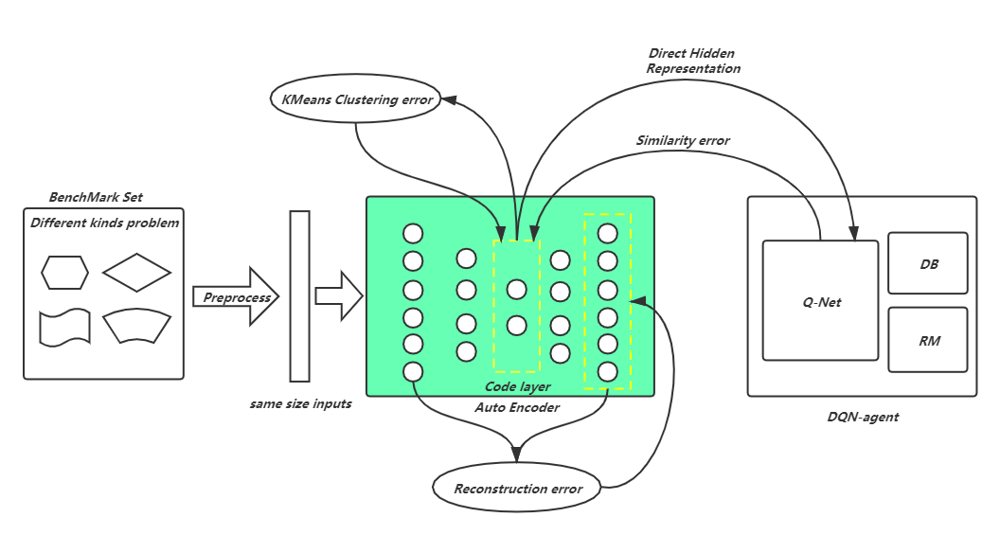

## AFEA: Accelerating Framework for Evolutionary Algorithm
___IEEE Transaction on Evolutionary Computing, paper: "AFEA:XXXXX"___

***AFEA combines DRL methods/AutoEncoder/Multitasking to totally accelerate solving High Frequency/High Concurrency problem like HFIP proposed in our previous paper"An Efficient Computational Approach for Automatic Itinerary Planning on Web Servers". Briefly speaking, AutoEncoder extract uniform features from different NP problem instances, DRL agent meanwhile is responsible making decisions/identifying similarity in history, MFEA proposed by [Gupta et al.](http://memetic-computing.org/publication/journal/Multifactorial_Evolution_ONLINE_VERSION.pdf) implicitly parallelize different instances to co-evolute, which means using unique group, decode solutions to different instances in their own specific forms. With aid of AFEA, solving efficiency greatly improves. Figure below shows the overview of AFEA.***

 

 ### FILE STRUCTURE
 > The ***code*** dir contains implementation of ***AFEA*** and other algorithms need to compare. You can check ***README.md*** in ***code***.
 
 > The ***data*** dir stores all correctly formed data which are used in every experiment in this project.
 
 > ***main.py*** is ***Entrance*** of AFEA which can be called to deploy any experiment or algorithm to data already included in ***data*** dir or indicated by user. Detail follows.

 > ***config.py*** controls ***configurations(i.e path of data/hyperparameters)***, anyone who wants to deploy an experiment should first indicate all neccessary configurations in this file.
 
 > The ***experiment*** dir maintains ***Runnning result/Running log***. There are 8 experiments with different forms of result respective;y. Feel free to check thier own ***README.md***

### main.py
\\todo

### config.py
\\todo

### Tutorial/Exsamples
\\todo

